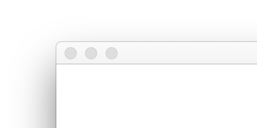
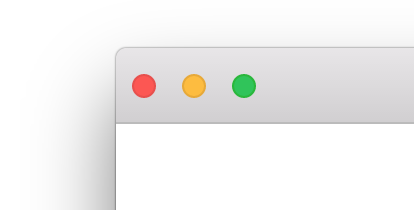
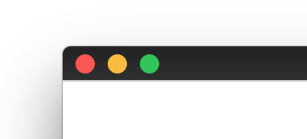
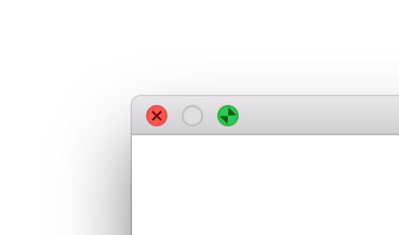
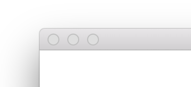
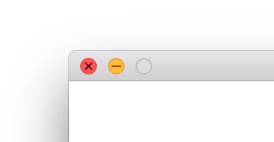

# About React-OSX-Titlebar

模拟 os x 标题栏的react组件

# Usage

```jsx
const TitleBar = require('../lib/titlebar');

const Body = React.createClass({
    render() {
        return (
            <div>
                <TitleBar />
            </div>
        )
    }
});
```

# Properties

### blur *`boolean`*
 - false *default*
 - true
   

### size *`string`* 

 - normal *default*
 - inset
 
   

 - center
 
   

### theme *`string`*

 - default *default*

 - inverse
   
   

### fullScreen *`boolean`*

 - false *default*

 - true
 
   
 

### disabled *`boolean`*

 - false *default*
 
 - true
 
   

### lockBtn *`Array`*

 - `[]`  *default*
   - close
   - minimize
   - normalScreen
   - fullScreen

   `<TitleBar lockBtn={['fullScreen']} />`
   
   
   
### Handler

`<TitleBar onClose={this.onClose} />`
 - onClose
 - onMinimize
 - onFullScreen
 - onNormalScreen (exit fullscreen mode)
